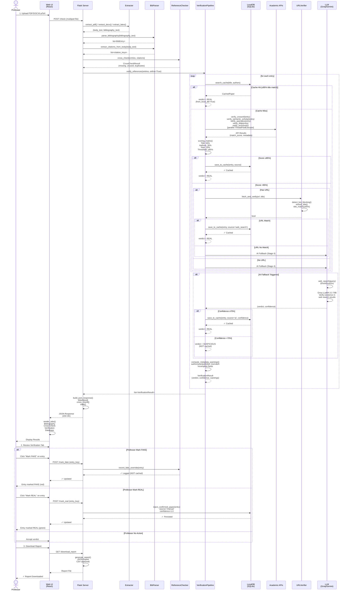

# LNI Reference Checker — UML & Flow Diagrams

## 1. System Flowchart

```mermaid
graph TD
    Start([User Uploads Document]) --> FileCheck{File Type?}
    
    FileCheck -->|PDF| ExtractPDF["<b>Extractor</b><br/>pdfplumber extraction<br/>Split at bibliography"]
    FileCheck -->|DOCX| ExtractDOCX["<b>Extractor</b><br/>python-docx parsing<br/>Split at bibliography"]
    FileCheck -->|LaTeX| ExtractLaTeX["<b>Extractor</b><br/>LaTeX markup stripping<br/>.bib file parsing"]
    
    ExtractPDF --> RawText["Raw Text + Bibliography"]
    ExtractDOCX --> RawText
    ExtractLaTeX --> RawText
    
    RawText --> Parser["<b>Parser</b><br/>LNI Key Validation<br/>Metadata Extraction<br/>BibEntry Creation"]
    
    Parser --> BibEntries["Bibliography Entries<br/>[Key, Title, Authors, Year, DOI, URL, ...]"]
    
    BibEntries --> CitationExtract["<b>Checker</b><br/>Extract Citations from Body Text<br/>LNI Key Lookup"]
    
    CitationExtract --> CrossCheck["<b>Cross-Check Analysis</b><br/>✗ Missing References<br/>✗ Unused Entries<br/>✗ Duplicates<br/>✓ Self-Citations"]
    
    CrossCheck --> Verification["<b>4-Stage Verification Pipeline</b>"]
    
    Verification --> Stage1["<b>Stage 1: Local Cache</b><br/>SQLite Lookup<br/>normalize_title()<br/>≥95% Title Match?"]
    
    Stage1 -->|Hit| CacheHit["<b style='color:green'>REAL</b><br/>from_local_db=True<br/>Instant Result"]
    Stage1 -->|Miss| Stage2
    
    Stage2["<b>Stage 2: Academic APIs</b><br/>Parallel ThreadPoolExecutor<br/>5 concurrent requests"]
    
    Stage2 --> API1["CrossRef API<br/>DOI Lookup"]
    Stage2 --> API2["Semantic Scholar<br/>Title Search"]
    Stage2 --> API3["OpenAlex<br/>Multidisciplinary"]
    Stage2 --> API4["DBLP<br/>CS Conferences"]
    Stage2 --> API5["arXiv<br/>Preprints"]
    
    API1 --> APIScore["<b>Scoring Matrix</b><br/>Title Match: 40%<br/>Author Overlap: 35%<br/>Year Exact: 25%<br/>Threshold: ≥85%"]
    API2 --> APIScore
    API3 --> APIScore
    API4 --> APIScore
    API5 --> APIScore
    
    APIScore -->|≥85%| APIHit["<b style='color:green'>REAL</b><br/>API Source Attribution<br/>Cache Entry Created"]
    APIScore -->|<85%| Stage3
    
    Stage3["<b>Stage 3: URL Validation</b><br/>fetch_with_timeout()<br/>Bot Detection<br/>Title Extraction"]
    
    Stage3 -->|URL + 403/429| URLFail["Skip to AI"]
    Stage3 -->|HTTP 200| URLParse["Extract Page Title<br/>≥95% Match?"]
    
    URLParse -->|Match| URLHit["<b style='color:green'>REAL</b><br/>URL Verified<br/>Cache Entry Created"]
    URLParse -->|No Match| Stage4
    URLFail --> Stage4
    
    Stage4["<b>Stage 4: AI Fallback</b><br/>Groq LLaMA 3.3 70B<br/>or Gemini 1.5 Flash"]
    
    Stage4 --> WebSearch["Web Search<br/>DuckDuckGo Results"]
    
    WebSearch --> LLMAnalysis["<b>LLM Semantic Analysis</b><br/>Query: Verify Reference Existence<br/>Context: Web Search Results<br/>Confidence Score: 0-100%"]
    
    LLMAnalysis -->|≥70%| AIHit["<b style='color:green'>REAL</b><br/>AI Confidence ≥70%<br/>Cache Entry Created"]
    LLMAnalysis -->|<70%| Suspicious["<b style='color:orange'>SUSPICIOUS</b><br/>Manual Review Required<br/>NOT Cached"]
    
    CacheHit --> MetadataWarn["<b>Metadata Warning Check</b><br/>Author/Year/Publisher Mismatch?<br/>Incomplete Fields?<br/>Severity Levels"]
    APIHit --> MetadataWarn
    URLHit --> MetadataWarn
    AIHit --> MetadataWarn
    Suspicious --> MetadataWarn
    
    MetadataWarn --> JSONResponse["JSON Response<br/>bibentries[]<br/>cross_check{}<br/>stats{}"]
    
    JSONResponse --> WebUI["<b>Web UI - React Frontend</b>"]
    
    WebUI --> Tab1["📋 Bibliography Tab<br/>All parsed entries<br/>Completeness warnings<br/>Metadata alerts"]
    
    WebUI --> Tab2["🔗 Cross-Check Tab<br/>Missing references<br/>Unused entries<br/>Duplicates"]
    
    WebUI --> Tab3["✓ Verification Tab<br/>Verdict badges<br/>Confidence scores<br/>Source attribution"]
    
    WebUI --> Tab4["💾 Database Tab<br/>Browse cached papers<br/>Search + pagination<br/>Delete/Inject"]
    
    Tab3 --> ProfessorAction{"Professor Action"}
    
    ProfessorAction -->|Mark FAKE| MarkFake["<b>Manual Override: FAKE</b><br/>User-confirmed hallucination<br/>Logged in review_queue<br/>NOT cached"]
    
    ProfessorAction -->|Mark REAL| MarkReal["<b>Manual Override: REAL</b><br/>Professor confirms legitimacy<br/>inject_confirmed_paper()<br/>SQLite: source='manual'<br/>confidence=1.0"]
    
    ProfessorAction -->|No Action| Accept["Entry Accepted<br/>REAL or SUSPICIOUS"]
    
    MarkFake --> Report["Generate Report<br/>Summary Statistics<br/>Verdict Breakdown"]
    MarkReal --> Report
    Accept --> Report
    
    Report --> Download["📊 Download Report<br/>JSON Export<br/>CSV (Optional)<br/>PDF Summary"]
    
    Download --> End(["✓ Verification Complete"])
    
    style Start fill:#E8F8F5
    style End fill:#E8F8F5
    style CacheHit fill:#D5F4E6
    style APIHit fill:#D5F4E6
    style URLHit fill:#D5F4E6
    style AIHit fill:#D5F4E6
    style Suspicious fill:#FADBD8
    style MarkFake fill:#FADBD8
    style MarkReal fill:#D5F4E6
    style ProfessorAction fill:#FCF3CF
```

---

## 2. UML Class Diagram

```mermaid
classDiagram
    direction TB

    %% Core Data Structures
    class BibEntry {
        +str key
        +str raw_text
        +str title
        +list~str~ authors
        +str year
        +str entry_type
        +str doi
        +str url
        +str urldate
        +str pages
        +str journal
        +str publisher
        +str booktitle
        --
        +validate_lni_key() bool
        +get_completeness_score() float
        +normalize_title() str
    }

    class CachedPaper {
        +str title
        +str authors
        +str year
        +str doi
        +str url
        +str source
        +float confidence
        +str last_seen
        +bool from_local_db
    }

    class VerificationResult {
        +str verdict: REAL|SUSPICIOUS|FAKE
        +float confidence
        +str source
        +dict metadata
        +list~str~ warnings
    }

    class CrossCheckResult {
        +list~str~ missing_bib_entries
        +list~str~ unused_entries
        +list~tuple~ duplicates
        +int self_citations
        +dict issues_by_severity
    }

    %% Extractors
    class Extractor {
        +extract_pdf(file_path) tuple~str, str~
        +extract_docx(file_path) tuple~str, str~
        +extract_latex(file_path, bib_file) tuple~str, str~
        #split_at_bibliography(text) tuple~str, str~
    }

    class PDFExtractor {
        -pdfplumber.PDF pdf
        +extract() tuple~str, str~
        #detect_bibliography_heading() int
    }

    class DOCXExtractor {
        -Document doc
        +extract() tuple~str, str~
    }

    class LaTeXExtractor {
        +extract_bibtex(bib_file) str
        +parse_bib_entries(bibtex) list~BibEntry~
    }

    %% Parser
    class BibParser {
        +parse_bibliography(text) list~BibEntry~
        +extract_citations_from_body(text) list~str~
        +validate_lni_key(key) bool
        +extract_metadata(entry_text) dict
        --
        -ENTRY_TYPE_PATTERNS: dict
        -REQUIRED_FIELDS: dict
    }

    %% Verification Pipeline
    class ReferenceChecker {
        +check_document(entries, body_text) VerificationResult~
        +cross_check(entries, citations) CrossCheckResult~
        +verify_references(entries, online) list~VerificationResult~
        -_verify_single(entry) VerificationResult
        --
        -threshold_real: float = 0.85
        -threshold_suspicious: float = 0.70
    }

    class VerificationPipeline {
        +verify(entry) VerificationResult
        -_stage1_cache(entry) VerificationResult
        -_stage2_apis(entry) VerificationResult
        -_stage3_url(entry) VerificationResult
        -_stage4_ai(entry) VerificationResult
    }

    %% Stage Implementations
    class LocalDBVerifier {
        +search_cache(title, authors) CachedPaper
        +save_to_cache(entry, source) bool
        +inject_confirmed_paper(title, authors) bool
    }

    class APIVerifier {
        -executors: ThreadPoolExecutor
        +verify_crossref(entry) VerificationResult
        +verify_semantic_scholar(entry) VerificationResult
        +verify_openalex(entry) VerificationResult
        +verify_dblp(entry) VerificationResult
        +verify_arxiv(entry) VerificationResult
        -_score_result(api_result, entry) float
    }

    class URLVerifier {
        +fetch_and_verify(url, title) bool
        -_extract_title(html) str
        -_bot_detection(status_code) bool
        -_title_match(page_title, ref_title) float
    }

    class AIVerifier {
        +verify_with_llm(entry, web_results) VerificationResult
        -_groq_verify(entry, context) tuple~str, float~
        -_gemini_verify(entry, context) tuple~str, float~
        -_web_search(query) list~dict~
    }

    %% Web Interface
    class Flask {
        +POST /check
        +POST /mark_fake
        +POST /mark_real
        +GET /database/papers
        +GET /database/stats
    }

    class ReactUI {
        +Bibliography Tab
        +Cross-Check Tab
        +Verification Tab
        +Database Tab
    }

    %% Database
    class LocalDB {
        +init_cache_db()
        +search_cache(title) CachedPaper
        +save_to_cache(paper) bool
        +get_all_papers(limit, offset) list~dict~
        +delete_paper(title) bool
        +get_cache_stats() dict
        --
        -verified_papers: SQLite Table
    }

    class ReviewQueue {
        +mark_fake(entry) bool
        +mark_real(entry) bool
        +get_review_history() list~dict~
    }

    %% Relationships
    BibParser --> BibEntry
    ReferenceChecker --> BibEntry
    ReferenceChecker --> CrossCheckResult
    ReferenceChecker --> VerificationResult

    VerificationPipeline --> LocalDBVerifier
    VerificationPipeline --> APIVerifier
    VerificationPipeline --> URLVerifier
    VerificationPipeline --> AIVerifier
    VerificationPipeline --> VerificationResult

    LocalDBVerifier --> CachedPaper
    LocalDBVerifier --> LocalDB

    APIVerifier --> VerificationResult
    URLVerifier --> VerificationResult
    AIVerifier --> VerificationResult

    Extractor --> PDFExtractor
    Extractor --> DOCXExtractor
    Extractor --> LaTeXExtractor

    Flask --> ReferenceChecker
    Flask --> BibParser
    Flask --> VerificationPipeline
    Flask --> ReviewQueue
    ReactUI --> Flask

    ReviewQueue --> LocalDB

    %% Styling
    style BibEntry fill:#E3F2FD
    style CachedPaper fill:#E3F2FD
    style VerificationResult fill:#E3F2FD
    style CrossCheckResult fill:#E3F2FD

    style ReferenceChecker fill:#FFF3E0
    style VerificationPipeline fill:#FFF3E0

    style LocalDBVerifier fill:#F3E5F5
    style APIVerifier fill:#F3E5F5
    style URLVerifier fill:#F3E5F5
    style AIVerifier fill:#F3E5F5

    style Flask fill:#C8E6C9
    style ReactUI fill:#C8E6C9
```

---

## 3. Sequence Diagram (Reference Verification Flow)

---

## Diagram Descriptions

### 1. System Flowchart
Shows the complete user journey from document upload through verification and professor actions. Highlights the 4-stage verification pipeline with decision points at each stage. Color-coded for verdicts: green (REAL), orange (SUSPICIOUS), red (FAKE).

### 2. UML Class Diagram
Illustrates system architecture with:
- **Data Models**: BibEntry, CachedPaper, VerificationResult, CrossCheckResult
- **Processing Modules**: Extractor (PDF/DOCX/LaTeX), BibParser, ReferenceChecker
- **Verification Pipeline**: VerificationPipeline orchestrating 4 stages
- **Stage Implementations**: LocalDBVerifier, APIVerifier, URLVerifier, AIVerifier
- **Web Layer**: Flask (backend), ReactUI (frontend)
- **Persistence**: LocalDB (SQLite), ReviewQueue

Color-coded by function: data models (blue), orchestration (orange), verification stages (purple), web layer (green).

### 3. Sequence Diagram
Traces a single reference verification request from upload through completion:
1. Document extraction (PDF/DOCX/LaTeX)
2. Bibliography parsing and citation extraction
3. Cross-check analysis (missing, unused, duplicates)
4. Verification pipeline (4 stages with decision trees)
5. JSON response to UI
6. Professor override actions (Mark FAKE/REAL)
7. Report generation and download

Emphasizes parallel API calls, fallback mechanisms, and caching at each stage.

---

## Architecture Highlights

- **4-Stage Pipeline**: Cache → APIs → URL → AI (with early exits on success)
- **Confidence Scoring**: Title (40%) + Authors (35%) + Year (25%)
- **Caching Strategy**: SQLite with title normalization; grows as tool is used
- **Parallel Processing**: ThreadPoolExecutor for concurrent API queries
- **Professor Workflow**: Manual FAKE/REAL overrides with persistent storage
- **Metadata Warnings**: Flags author/year/publisher mismatches even for REAL entries
- **Grey Literature**: Lower thresholds (75% vs 85%) for industry reports and white papers
